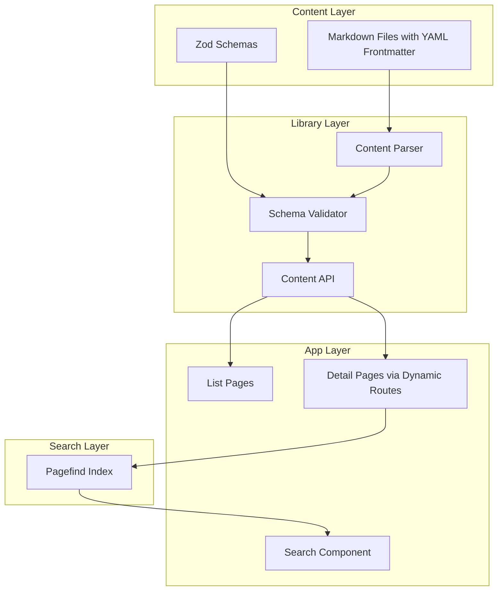

# Static Content System with Pagefind Search

## Architecture Overview




## Directory Structure

```javascript
content/
  handbook/
    index.md                    # Optional section overview
    onboarding/
      getting-started.md
      day-one.md
    policies/
      remote-work.md
  products/
    main-product.md
    feature-x.md
  services/
  frameworks/
  decisions/
  playbooks/
  strategy/

lib/
  content/
    schemas.ts                  # Zod schemas for all content types
    loader.ts                   # File system content loading
    parser.ts                   # Markdown + frontmatter parsing
    types.ts                    # TypeScript types

app/
  handbook/
    page.tsx                    # List page
    [...slug]/
      page.tsx                  # Dynamic nested routes
  (similar for other content types)
  
components/
  content/
    search.tsx                  # Pagefind search component
    content-list.tsx            # Reusable list component
    content-article.tsx         # Article renderer
```


## Key Implementation Details

### 1. Zod Schemas (`lib/content/schemas.ts`)

Each content type gets a specific schema. Base schema includes:

```typescript
const baseContentSchema = z.object({
  title: z.string(),
  description: z.string().optional(),
  date: z.coerce.date().optional(),
  updated: z.coerce.date().optional(),
  draft: z.boolean().default(false),
  tags: z.array(z.string()).optional(),
  order: z.number().optional(), // For manual sorting
});

// Type-specific extensions
const decisionSchema = baseContentSchema.extend({
  status: z.enum(["proposed", "accepted", "deprecated", "superseded"]),
  deciders: z.array(z.string()).optional(),
  date: z.coerce.date(), // Required for decisions
});

const playbookSchema = baseContentSchema.extend({
  difficulty: z.enum(["beginner", "intermediate", "advanced"]).optional(),
  duration: z.string().optional(), // e.g., "30 minutes"
});
```


### 2. Content Loader (`lib/content/loader.ts`)

- Uses Node.js `fs` to read markdown files at build time
- Parses YAML frontmatter with `gray-matter` package
- Validates against Zod schemas
- Returns typed content with computed slug from file path

### 3. Dynamic Routes

Each content type uses Next.js catch-all routes (`[...slug]/page.tsx`) to support nested paths:

```typescript
// app/handbook/[...slug]/page.tsx
export async function generateStaticParams() {
  const articles = await getAllContent("handbook");
  return articles.map((article) => ({
    slug: article.slug.split("/"),
  }));
}
```


### 4. Pagefind Integration

- Install `pagefind` as a dev dependency
- Add data attributes to content for indexing: `data-pagefind-body`
- Build script runs `pagefind --site .next` after Next.js build
- Client-side search component loads Pagefind JS dynamically
- Make sure not to use output: export and leverage the build process instead

### 5. Search Component

A global search component using Pagefind's client-side JS:

```typescript
// Uses dynamic import of pagefind.js
// Command palette style (Cmd+K) or dedicated search page
```


## Dependencies to Add

- `gray-matter` - YAML frontmatter parsing
- `pagefind` - Static search indexing
- `remark` + `remark-html` or `next-mdx-remote` - Markdown rendering

## Files to Modify

| File | Change ||------|--------|| [package.json](package.json) | Add dependencies and build scripts || [next.config.ts](next.config.ts) | Configure static output for Pagefind || [app/handbook/page.tsx](app/handbook/page.tsx) | Replace with content list || (similar for 6 other content types) | Dynamic routes and list pages |

## Example Content File

```markdown
---
title: Getting Started
description: Your first day at the company
date: 2025-01-15
tags: [onboarding, new-hire]
order: 1
---

# Welcome to the Team

Content goes here...


```