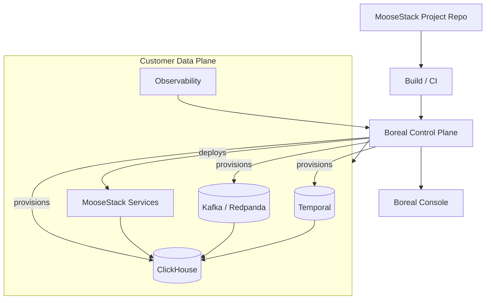

# Boreal

  <Badge>Commercial</Badge>
  <Badge variant="secondary">Deploy + Scale</Badge>
  <Badge variant="secondary">Enterprise Controls</Badge>

Boreal is the **managed platform** for running MooseStack in production. Deploy with Git, operate the data plane (OLAP, streaming, workflows), and ship with confidence—without managing the stack yourself.

<Callout type="info" title="What it is not">
Boreal is **not** a general-purpose app hosting platform. It's optimized for operating MooseStack analytical backends with production-grade controls.
</Callout>

---

## Ideal Users

<Grid cols={2}>
  <Card className="not-prose">
    <CardHeader>
      <CardTitle className="flex items-center gap-2"><Cloud className="h-4 w-4" /> Teams shipping to production</CardTitle>
    </CardHeader>
    <CardContent className="text-sm space-y-1">
      - Product teams scaling from OSS pilots to customer workloads
      - Platform teams that need standardized environments
      - Enterprises needing compliance + access controls
    </CardContent>
  </Card>
  <Card className="not-prose">
    <CardHeader>
      <CardTitle className="flex items-center gap-2"><Building className="h-4 w-4" /> Sales & Solutions</CardTitle>
    </CardHeader>
    <CardContent className="text-sm space-y-1">
      - **Fast path**: "we host and operate it"
      - **Flexible path**: BYO cloud/VPC and/or existing databases
      - Enterprise security posture (SSO/RBAC, isolation)
    </CardContent>
  </Card>
</Grid>

---

## Value Proposition

| Outcome | How Boreal delivers |
|---------|---------------------|
| **Time-to-prod drops** | Standardized deployment path for MooseStack |
| **Ops burden drops** | Scaling, backups, and incident surface area are handled |
| **Safer change management** | Environments and tooling reduce "schema surprise" |
| **Enterprise-ready** | Identity + access + network controls aligned with buyer requirements |

---

## Distribution & Packaging

<Grid cols={2}>
  <Card className="not-prose">
    <CardHeader>
      <CardTitle>Distribution</CardTitle>
      <CardDescription>How it's sold</CardDescription>
    </CardHeader>
    <CardContent className="text-sm space-y-1">
      - Primarily sales-led (expansion from MooseStack adoption)
      - Enterprise procurement: security, compliance, deployment model
      - Can land via OSS pilots, then expand to managed production
    </CardContent>
  </Card>
  <Card className="not-prose">
    <CardHeader>
      <CardTitle>Packaging</CardTitle>
      <CardDescription>Common deployment models</CardDescription>
    </CardHeader>
    <CardContent className="text-sm space-y-1">
      - **Managed**: Boreal provisions + operates the full stack
      - **BYO cloud/VPC**: deploy into the customer's environment
      - **BYO systems**: integrate with existing databases/streams
    </CardContent>
  </Card>
</Grid>

---

## Feature Set

<Grid cols={3}>
  <Card className="not-prose">
    <CardHeader>
      <CardTitle>Deployments</CardTitle>
      <CardDescription>Standardize release flow</CardDescription>
    </CardHeader>
    <CardContent className="text-sm">
      - Git-integrated deploys
      - Multi-environment (dev/stage/prod)
      - Ephemeral preview environments
    </CardContent>
  </Card>
  <Card className="not-prose">
    <CardHeader>
      <CardTitle>Operations</CardTitle>
      <CardDescription>Reliability primitives</CardDescription>
    </CardHeader>
    <CardContent className="text-sm">
      - Autoscaling + capacity management
      - Backups + recovery
      - Monitoring, logs, alerting
    </CardContent>
  </Card>
  <Card className="not-prose">
    <CardHeader>
      <CardTitle>Enterprise Controls</CardTitle>
      <CardDescription>Security + governance</CardDescription>
    </CardHeader>
    <CardContent className="text-sm">
      - RBAC + SSO integration
      - Network isolation options
      - Auditability + compliance (SOC2 Type 2)
    </CardContent>
  </Card>
</Grid>

---

## Architecture

---

## Links

  <LinkButton href="https://www.fiveonefour.com/enterprise">Enterprise Overview</LinkButton>
  <LinkButton href="https://www.fiveonefour.com/pricing" variant="secondary">Pricing</LinkButton>

