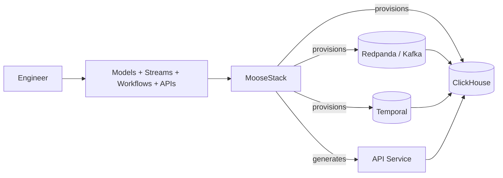

# MooseStack

  <Badge>Open Source</Badge>
  <Badge variant="secondary">TypeScript + Python</Badge>
  <Badge variant="secondary">MIT License</Badge>

MooseStack is a **code-first framework** for building analytical backends. Define tables, streams, workflows, and APIs in TypeScript or Python—no YAML, no integration glue.

<Callout type="info" title="What it is not">
MooseStack is **not** a BI/dashboard product and **not** an OLTP database replacement. It's an engineering toolkit for analytics infrastructure.
</Callout>

---

## Ideal Users

<Grid cols={2}>
  <Card className="not-prose">
    <CardHeader>
      <CardTitle className="flex items-center gap-2"><Code className="h-4 w-4" /> Engineering teams</CardTitle>
    </CardHeader>
    <CardContent className="text-sm space-y-1">
      - Backend + full-stack engineers shipping analytics features
      - Platform engineers standardizing analytics primitives
      - Data engineers who want Git-native, testable pipelines
    </CardContent>
  </Card>
  <Card className="not-prose">
    <CardHeader>
      <CardTitle className="flex items-center gap-2"><Users className="h-4 w-4" /> Internal stakeholders</CardTitle>
    </CardHeader>
    <CardContent className="text-sm space-y-1">
      - **PM**: faster iteration on data-backed product bets
      - **Design**: reliable real-time surfaces (leaderboards, dashboards)
      - **Sales**: differentiation via modern analytics infra
    </CardContent>
  </Card>
</Grid>

---

## Value Proposition

| Outcome | How MooseStack delivers |
|---------|-------------------------|
| **One codebase** | Schemas, ingestion, transforms, and query APIs live together |
| **Less integration glue** | Framework wires OLAP + streaming + workflows + APIs |
| **Faster local iteration** | Docker-based infra parity with hot reload and continuous migrations |
| **Software-engineering native** | Strong typing, version control, CI, tests |

---

## Distribution & Packaging

<Grid cols={2}>
  <Card className="not-prose">
    <CardHeader>
      <CardTitle>Distribution</CardTitle>
      <CardDescription>How it spreads</CardDescription>
    </CardHeader>
    <CardContent className="text-sm space-y-1">
      - MIT-licensed open source on GitHub
      - Templates + reference apps drive adoption
      - Developer-first: "try locally in minutes"
    </CardContent>
  </Card>
  <Card className="not-prose">
    <CardHeader>
      <CardTitle>Packaging</CardTitle>
      <CardDescription>How teams consume it</CardDescription>
    </CardHeader>
    <CardContent className="text-sm space-y-1">
      - CLI workflow (`moose dev`) for local stack + hot reload
      - Modules: OLAP, Streaming, Workflows, API generation
      - Deploy self-hosted **or** via Boreal (managed)
    </CardContent>
  </Card>
</Grid>

---

## Feature Set

<Grid cols={3}>
  <Card className="not-prose">
    <CardHeader>
      <CardTitle>Everything as Code</CardTitle>
      <CardDescription>No separate YAML config</CardDescription>
    </CardHeader>
    <CardContent className="text-sm">
      - Tables + schemas
      - Streams + ingestion
      - Workflows + orchestration
    </CardContent>
  </Card>
  <Card className="not-prose">
    <CardHeader>
      <CardTitle>Typed APIs</CardTitle>
      <CardDescription>Ship endpoints safely</CardDescription>
    </CardHeader>
    <CardContent className="text-sm">
      - Ingest endpoints
      - Analytical query endpoints
      - Generated OpenAPI + migrations
    </CardContent>
  </Card>
  <Card className="not-prose">
    <CardHeader>
      <CardTitle>Local-First DX</CardTitle>
      <CardDescription>Fast iteration loop</CardDescription>
    </CardHeader>
    <CardContent className="text-sm">
      - Dockerized infra parity
      - Hot reload
      - Schema changes applied continuously
    </CardContent>
  </Card>
</Grid>

---

## Architecture

---

## Links

  <LinkButton href="https://github.com/514-labs/moosestack">GitHub Repository</LinkButton>
  <LinkButton href="https://github.com/514-labs/moosestack/blob/bcababc3c2249ccd50d2fd7e08b53dbfa02fead8/README.md" variant="secondary">README</LinkButton>

