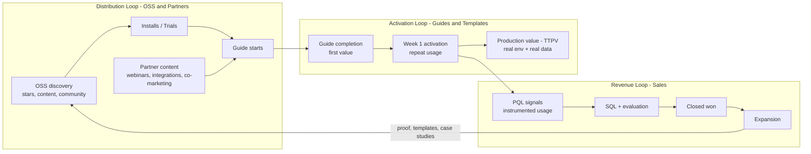
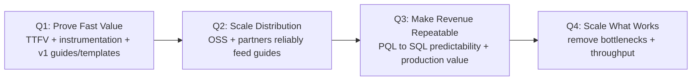

# FY26 Roadmap

## What we're solving

Developer infrastructure is crowded. Trust is earned **bottom-up** via fast proof, not top-down persuasion. Our fastest path to $10M ARR is to make Boreal **undeniable in a developer's first session**, then convert that evidence into revenue through **product-qualified sales** and **partners**.

This roadmap is a simplification: fewer goals, fewer initiatives, clearer ownership, and a hard tie-break rule.

---

## FY26 goals

**Company outcomes (3)**

- **$10M ARR run-rate** (acceptable slip: +2 quarters "good", +4 quarters "passable")
- **Maintain 12+ months runway**
- **OSS traction: 20K GitHub stars** (paired with usage signals, not vanity alone)

**Tie-break rule**
When initiatives compete, we prioritize improvements that increase **discoverability → activation → conversion**, especially **TTFV/TTPV and Week 1 activation**, over bespoke work and top-down persuasion.

---

## The strategy in one paragraph

We ship value through **Guides + Templates** as the default delivery mechanism: measurable, repeatable, composable paths from "new" → "working outcome" → "production outcome." Distribution comes from **OSS + partner content** that routes into those guides/templates. Sales converts **product evidence** into contracts using **PQL signals** and **evidence-led outbound** that drives guided product interaction—not pressure.

---

## The operating model: three reinforcing loops

- **Activation Loop (PLM):** Guides + Templates reduce TTFV/TTPV and raise Week 1 activation
- **Distribution Loop (OSS + Partners):** credible channels increase the number of developers entering guides
- **Revenue Loop (SLG):** sales converts activated usage into ARR and expansion using PQL signals

---

## Guides + Templates (the delivery mechanism)

**Non-negotiable rule:** new onboarding flows, partner content, and POC motions must land a user in a **guide and/or template**. If work can't be expressed as a guide/template, it's suspect (bespoke, hard to self-serve, hard to scale).

**Definitions**

- **Guide:** instrumented journey from "new" → working outcome → production outcome
- **Template:** opinionated starting point (patterns, configs, integrations) that makes success repeatable
- **Production value (TTPV):** running in the user's real environment, connected to real systems, producing persistent outputs

---

## Evidence-Led Outbound (Sales-Assisted PLM)

We have a sales team. The question is not "outbound vs no outbound." The question is whether outbound **reinforces product proof**.

**Outbound's job**

- Trigger **product interaction with measurable outcomes**
- Route prospects into **guides/templates**
- Use **PQL evidence** to time and shape sales engagement

**Guardrails**

- Every outbound touch routes to an **instrumented guide/template**
- Measured end-to-end: **source → guide start → completion → activation → PQL**
- Evaluated on **activation outcomes**, not outbound volume

---

## Metrics: simplify to what we will actually steer by

**Company steering metrics (6)**

1. **TTFV**
2. **Week 1 activation rate**
3. **# active Boreal projects** (usage depth)
4. **PQL volume + PQL→SQL conversion**
5. **ARR (and NRR once we have a meaningful base)**
6. **GitHub stars** (plus one usage proxy like OSS installs/month as supporting)

Everything else (booked meetings, total pipeline, community members, plan mix) is **supporting**, owned by functions—not "company KPIs."

---

## FY26 quarterly plan (simplified)

We will run FY26 on four themes. Each quarter should have **3–5 goals** and **3–5 initiatives max**.

### Q1 — Prove Fast Value

**Outcomes**

- TTFV is reliably under 10 minutes
- Activation and PQL instrumentation is live and trusted
- Guides + Templates v1 becomes the default path

**Initiatives**

- **Guides + Templates v1:** flagship "first value" guide + starter templates
- **Golden Path onboarding:** remove friction, raise completion
- **Instrumentation:** activation events + PQL scoring live (CRM + product)
- **Evidence-led outbound v1:** sales distributes guides, measured on activation

### Q2 — Scale Distribution

**Outcomes**

- Guide starts scale (more qualified developers entering the activation loop)
- Partner/OSS channels are measurable and repeatable
- First consistent PQL→SQL motion

**Initiatives**

- **Guides + Templates library v2:** expand to a menu of high-intent outcomes
- **Partner content engine:** standard landing pages + tracking + cadence
- **OSS docs/install loop:** discovery → install → guide start improvements
- **Sales playbook v1:** tight follow-up sequences aligned to guide outcomes

### Q3 — Make Revenue Repeatable

**Outcomes**

- PQL→SQL conversion predictable; cycles compress
- Clear path from activation → production value (TTPV drops materially)
- Expansion motion becomes provable (not hypothetical)

**Initiatives**

- **Production guides:** production-grade outcomes, fewer POCs that stall
- **Packaging/pricing tuning:** reduce confusion, align with usage/projects
- **Sales process hardening:** stages with exit criteria; no "vibes" pipeline
- **Buyer partners:** influence pipeline with measurable downstream action

### Q4 — Scale What Works

**Outcomes**

- Growth engine is documented and repeatable
- Activation holds under higher volume
- ARR run-rate achieved or clearly within the slip window

**Initiatives**

- **Platform excellence:** performance + reliability as growth constraints vanish
- **Activation optimization:** conversion rate and retention improvements
- **Partner flywheel:** both motions operating at cadence (dev + buyer)
- **Sales capacity scaling:** only after the playbook is proven

---

## What we will not do

- We will not pursue **outbound-led growth as the primary motion**
- We will not build **bespoke enterprise features** without PLM validation
- We will not optimize **awareness without an activation path** (every campaign routes into a guide/template)
- We will not chase revenue that undermines retention, expansion, or repeatability

---

## How we plan and execute (quarterly planning)

Each initiative must specify:

- **Who:** initiative owner + project owners
- **What:** what ships (specific, not vibes)
- **How:** weekly check-ins + leading indicators
- **When:** delivery + reflection dates
- **Why:** which loop it strengthens + which KPI it moves

Quarterly planning output:

1. Goals (3–5)
2. Initiatives (3–5)
3. Starter project list (1–3 weeks each)
4. 1-page narrative
5. Explicit "killed work" list
