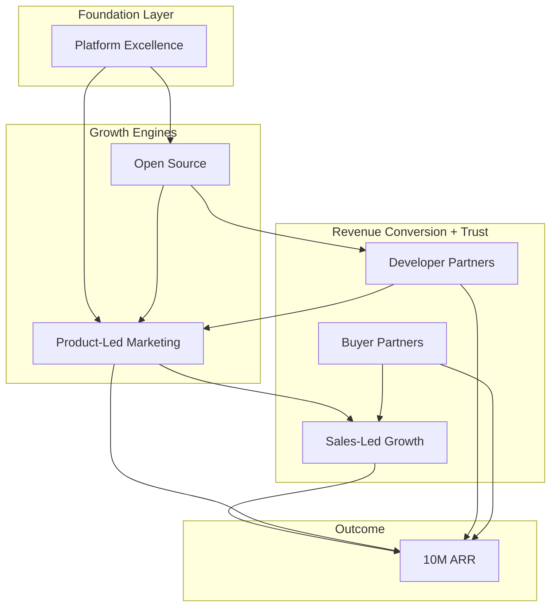
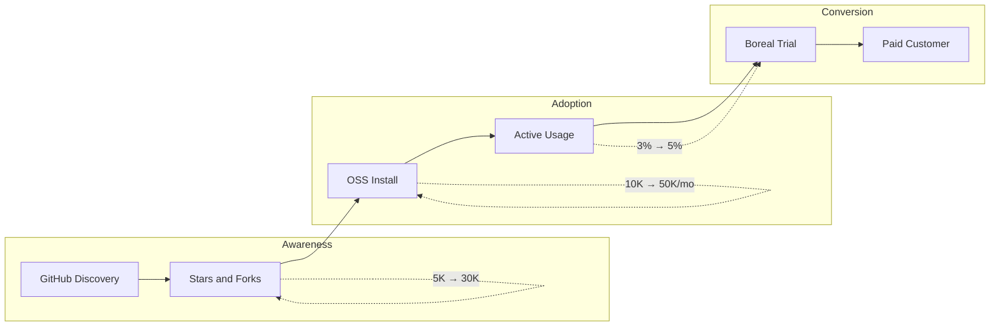
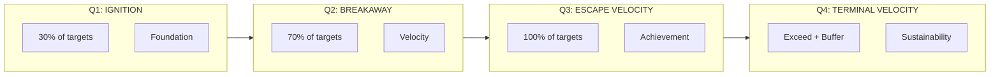
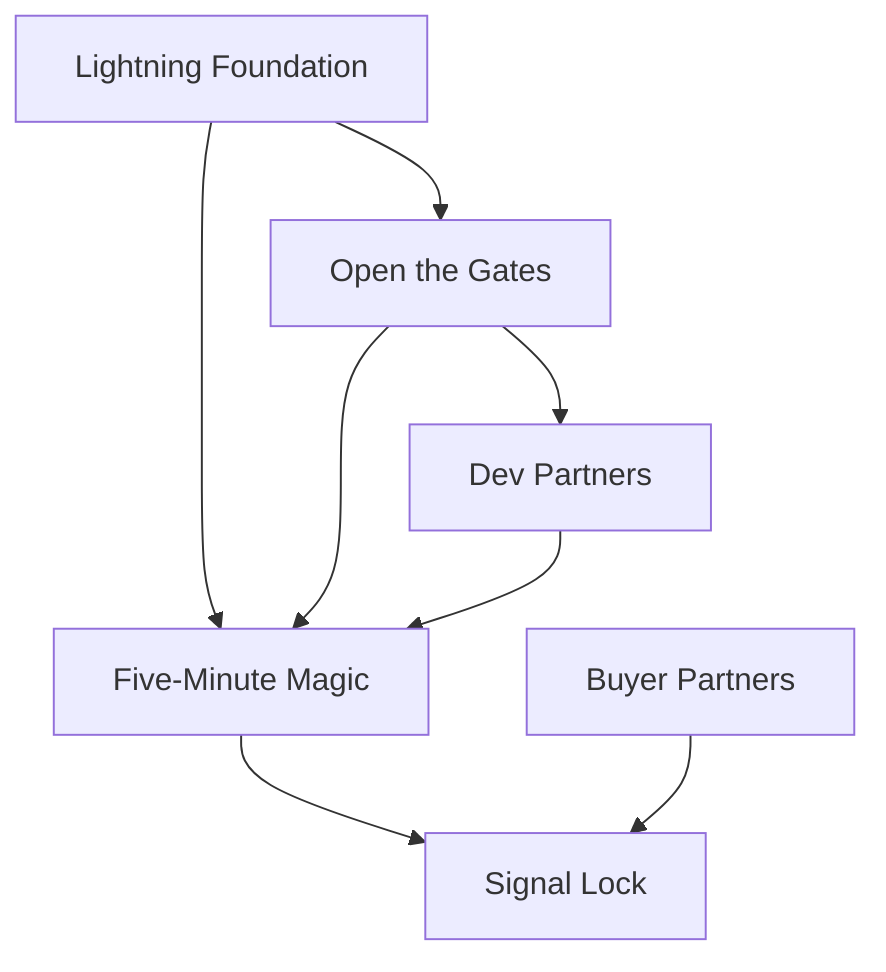
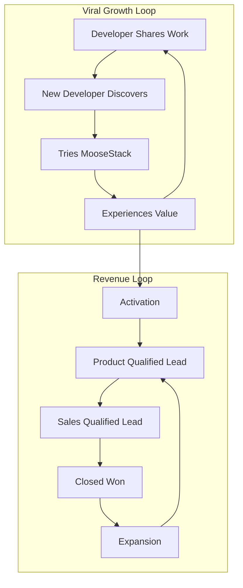
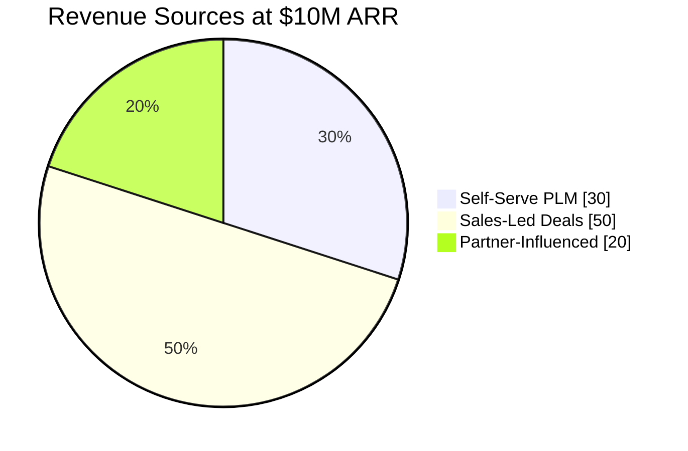
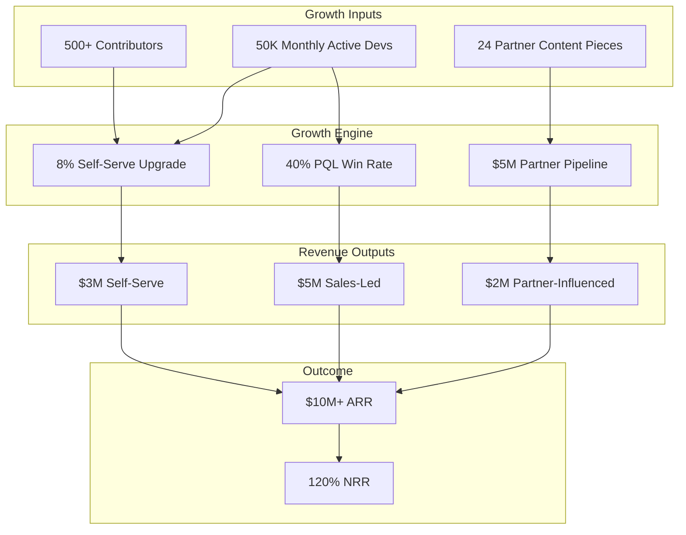
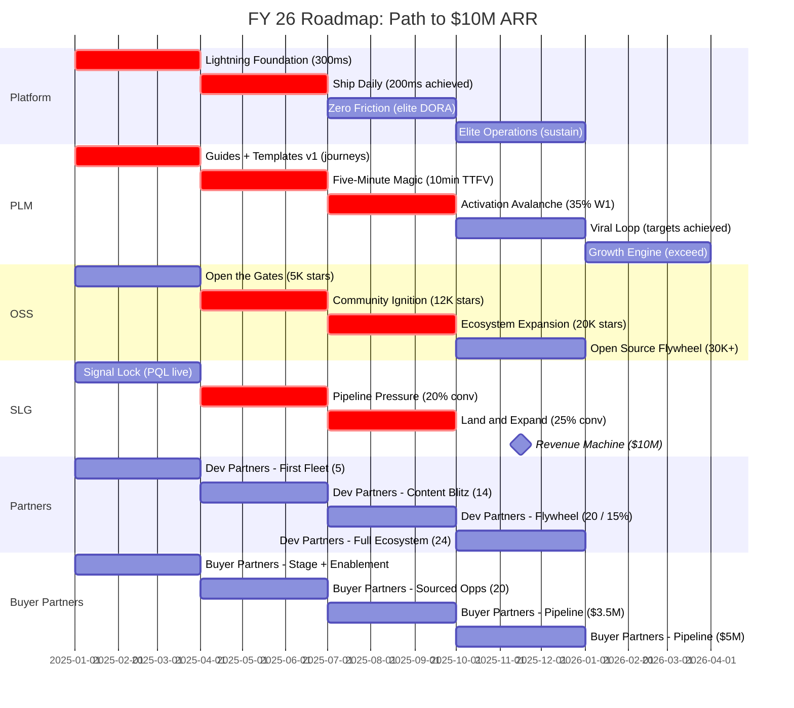

# FY 26 Roadmap

The path to $10M ARR in 12 months. This roadmap breaks down our five strategic goals into aggressive quarterly initiatives with clear ownership and measurable targets.

## Strategic Diagnosis

Developer infrastructure markets are crowded and buyer trust is earned bottom-up, not top-down. The fastest path to $10M ARR is to make Boreal undeniable through developer adoption (fast time-to-first-value, high activation, and shareable outputs), then convert that proof into revenue via product-qualified sales and technical ecosystem partners. This strategy explicitly prioritizes product evidence over outbound persuasion.

## Guiding Policy (Focus + Tradeoffs)

**Primary Growth Wedge:** Product-Led Marketing (PLM) powered by self-serve onboarding and OSS distribution.

**Secondary Accelerators:** Sales-Led Growth (SLG) converts product evidence into mid-market and enterprise contracts; Partners amplify trusted distribution and pipeline.

**Tie-break rule:** When initiatives compete, we prioritize changes that improve discoverability → activation → conversion (especially time-to-first-value and Week 1 activation) over bespoke features, one-off campaigns, or top-down persuasion. In practice, this means we ship value primarily through **Guides + Templates** (below), not ad-hoc docs or one-off implementations.

## Guides + Templates (The Delivery Mechanism)

To reduce time-to-first-value (TTFV) and (more importantly) **time-to-realized-value (TTRV)**, we introduce **Guides** and **Templates** as the default way work ships to users:

- **Guides**: guided, instrumented journeys that take a developer from “new” to a working outcome (and later, a production outcome)
- **Templates**: opinionated starting points (implementation patterns, integrations, configs) that make success repeatable
- **AI-based implementation**: AI can only be reliable when it composes from known-good building blocks; **templates are the building blocks** and guides are the orchestration layer

**Non-negotiable rule:** New onboarding flows, partner content, and POC motions must land a user in a guide and/or template. If work can’t be expressed as a guide/template, it is suspect (likely bespoke, hard to self-serve, and hard to scale).

**Key Guide/Template Metrics (leading indicators):**
- Guide start rate (of new signups)
- Guide completion rate (core “first value” journey)
- Template adoption rate (per guide)
- **TTRV**: median time from signup → **first production-grade implementation** (target: reduce from weeks to days)

**Definition (TTRV / production-grade):** The user has a working implementation running in their real environment (not a demo): configured from a template, connected to real data/systems, and producing persistent outputs suitable for ongoing use.

## What “Good $10M ARR” Means (Constraints)

Reaching $10M ARR is not the only objective — *how* we get there determines whether FY27 is durable.

- **Retention first**: Net Revenue Retention (NRR) at **120%** by Q4
- **Demand base**: **50K Monthly Active Developers** as the top-of-funnel leading indicator
- **Self-serve conversion**: **5% PLM-to-paid conversion** as the conversion floor for the PLM motion
- **Sales predictability**: **3x sales-qualified pipeline coverage** to avoid end-of-quarter heroics
- **Balanced engine**: material contribution from both PLM and SLG (not a single-motion spike)
- **Evidence before pressure**: sales scales on PQL signals (instrumentation + activation), not intuition
- **Partner leverage, not placebo**: partner work must show measurable downstream action (signups, qualified opportunities, pipeline)

## What We Will Not Do

- We will not pursue outbound-led growth as the primary motion.
- We will not build bespoke enterprise features without PLM validation (clear activation/expansion triggers).
- We will not optimize awareness without an activation path (content/campaigns must connect to onboarding and measurement).
- We will not chase revenue that undermines retention, expansion, or repeatability.

---

## Evidence-Led Outbound (Sales-Assisted PLM)

We have a sales team. The question is not *whether* they do outbound, but *how* outbound reinforces (rather than undermines) product-led growth.

**Reframe:** Outbound is not the primary growth motion. Outbound is a **distribution accelerator** that increases exposure to product proof.

> **Outbound's job is not to sell promises.
> Outbound's job is to trigger product interaction with measurable outcomes.**

### Guardrails (Evidence Before Pressure)

Outbound is "allowed" when:

- It **routes to a Guide and/or Template** (non-negotiable)
- It is **instrumented** end-to-end (source → activation → PQL)
- It is evaluated on **downstream product evidence**, not meetings booked

### Guide-First Outbound Quality Bar

Every outbound touch must answer:

- **What can the recipient accomplish in under 10 minutes?**
- **Which Guide/Template is the path to value?**
- **What activation signal will we measure?**

If an outbound message cannot link to an instrumented Guide/Template → it doesn't ship.

### Operating Model

| Owner | Responsibility |
|-------|----------------|
| **Product/PLM** | Guide/Template creation + instrumentation |
| **Sales** | Distribution to target accounts and role-based entry points |
| **Sales** | Engagement **after** product evidence exists (Guide start/completion, PQL signals) |

### Success Metrics (Product-First)

**Primary (activation-focused):**
- Outbound → Guide start rate
- Outbound cohort Guide completion rate
- Outbound cohort TTFV (time-to-first-value)
- Outbound cohort Week 1 activation

**Secondary (revenue linkage):**
- Outbound → PQL rate
- PQL → SQL conversion (outbound cohort vs organic)
- Sales cycle / win rate vs non-outbound cohorts

**Explicitly not primary:**
- Meetings booked
- Emails sent
- Reply rate in isolation

---

## Strategic Pillars

The five pillars work together to create a reinforcing growth engine. **Partners** run as two distinct motions (developer distribution + buyer pipeline influence) to keep ownership and metrics unambiguous.

---

## Open Source Strategy

MooseStack is the open-source foundation that drives Boreal adoption:

**Key OSS Metrics:**
- GitHub stars (awareness)
- Monthly installs (adoption)
- Active contributors (community health)
- OSS-to-Boreal conversion rate (monetization)

---

## Partner Strategy (Two Motions, One Principle)

Partners do two distinct jobs and are measured differently. We explicitly separate these motions so “partner success” doesn’t become ambiguous.
See [Build Awareness Through Technical Partners](/goals/partner-awareness).

### Developer Partners (PLM-Focused)

- **Job**: trusted distribution + credibility that drives self-serve onboarding
- **Primary KPIs**: partner content pieces; content → signup rate; partner-driven onboarding starts; activation rate from partner cohorts

### Buyer Partners (SLG-Focused)

- **Job**: influence pipeline and deals through partner sales/technical teams
- **Primary KPIs**: partner-sourced qualified opportunities; partner-influenced pipeline; partner-influenced ARR

**Rule:** Not every partner does both. We track, enable, and iterate on these motions independently.

---

## Quarterly Progression

Each quarter builds on the last, with aggressive front-loading of targets:

---

## Q1: IGNITION (Months 1-3)

*"Move fast, break nothing, ship everything."*

| Pillar | Initiative | Target | Owner |
|--------|------------|--------|-------|
| **Platform** | **Lightning Foundation** | P95 latency to 300ms (40% reduction); 75% onboarding completion; 12 deploys/week | CTO |
| **PLM** | **Five-Minute Magic** | Time-to-first-value under 10 minutes; 25% Week 1 activation; **Guides + Templates v1 live** (first-value guide + starter templates); full activation instrumentation live; **TTRV (production guide cohort) under 7 days** | Head of Product |
| **PLM/OSS** | **Open the Gates** | 5,000 GitHub stars; 50 external contributors; MooseStack docs revamp live; first 10K OSS installs/month; **first 5 OSS templates published** | CTO |
| **SLG** | **Signal Lock** | PQL scoring live in HubSpot; First 10 PQL-to-SQL conversions; Sales team trained on product-led motion | Head of Sales |
| **Partners** | **First Fleet** **(Dev Partners + Buyer Partners)** | **Dev partners:** 5 anchor partners signed; 6 co-created content pieces shipped; first partner webinar with 500+ registrants; **100% of partner content routes into a guide/template** **Buyer partners:** partner-qualified stage live in HubSpot; 5 partner-sourced qualified opportunities; 3 partner enablement sessions; **POC template pack v1** | Chief of Staff Head of Sales |

### Q1 Success Criteria

- Platform foundation supports 10x growth without rearchitecture
- Developers can experience value in their first session
- Guides and templates become the default path to value (measurable, repeatable, and self-serve)
- OSS community shows early signs of self-sustaining growth
- Sales has the tools and training to work product-qualified leads
- Partner motions are separated and measurable (developer distribution vs buyer pipeline)

### Q1 Initiative Dependencies

---

## Q2: BREAKAWAY (Months 4-6)

*"Outpace the market. Every week counts."*

| Pillar | Initiative | Target | Owner |
|--------|------------|--------|-------|
| **Platform** | **Ship Daily** | P95 latency to 200ms (target achieved); 18 deploys/week; Change failure rate under 8%; MTTR under 60 minutes | CTO |
| **PLM** | **Activation Avalanche** | TTFV under 7 minutes; 35% Week 1 activation; 4% self-serve upgrade rate; 15% viral signups; **Guides + Templates library v2** (10+ guides, 25+ templates); **TTRV (production guide cohort) under 3 days** | Head of Product |
| **PLM/OSS** | **Community Ignition** | 12,000 GitHub stars; 150 contributors; First community-led feature shipped; 25K OSS installs/month; Discord at 2,000 members | CTO |
| **SLG** | **Pipeline Pressure** | 20% PQL-to-SQL conversion; Sales cycle under 60 days; First $75K+ deal closed; 15 enterprise POCs active | Head of Sales |
| **Partners** | **Content Blitz** **(Dev Partners + Buyer Partners)** | **Dev partners:** 14 cumulative content pieces; 12% content-to-signup rate; partner cohorts tracking live; **partner content uses standard guide/template landing pages** **Buyer partners:** 20 partner-sourced opportunities; $1.5M partner-influenced pipeline; **POCs run on templates (measured)** | Chief of Staff Head of Sales |

### Q2 Success Criteria

- Platform performance targets achieved — no longer a constraint
- Activation funnel optimized with clear conversion paths
- OSS community actively contributing, not just consuming
- First major enterprise deal closed, proving SLG motion works
- Partner engine running at cadence with measurable outputs for both motions

---

## Q3: ESCAPE VELOCITY (Months 7-9)

*"Growth that compounds. Revenue that scales."*

| Pillar | Initiative | Target | Owner |
|--------|------------|--------|-------|
| **Platform** | **Zero Friction** | 82% onboarding completion; 20 deploys/week; 5% change failure rate; 35-minute MTTR | CTO |
| **PLM** | **Viral Loop** | TTFV under 5 minutes (target achieved); 40% Week 1 activation (target achieved); 6% self-serve; 20% viral; 45% retention; **AI-assisted implementation v1 built on templates**; **TTRV (production guide cohort) under 48 hours** | Head of Product |
| **PLM/OSS** | **Ecosystem Expansion** | 20,000 GitHub stars; 300 contributors; 3 major community plugins; 40K OSS installs/month; OSS-to-Boreal conversion at 3% | CTO |
| **SLG** | **Land and Expand** | 25% PQL-to-SQL (target achieved); 50-day sales cycle; $65K ACV; 20% expansion revenue; 35% PQL win rate | Head of Sales |
| **Partners** | **Ecosystem Flywheel** **(Dev Partners + Buyer Partners)** | **Dev partners:** 20 content pieces; 15% content-to-signup (target achieved) **Buyer partners:** 40 partner opportunities; $3.5M partner-influenced pipeline | Chief of Staff Head of Sales |

### Q3 Success Criteria

- Most annual targets achieved — Q4 is for exceeding, not catching up
- Product-led growth is self-sustaining with viral mechanics working
- OSS ecosystem has independent momentum with community plugins
- Sales motion is repeatable and predictable
- Partners are driving both measurable developer distribution and pipeline influence

### Q3 Growth Flywheel

---

## Q4: TERMINAL VELOCITY (Months 10-12)

*"Cross the finish line at full speed."*

| Pillar | Initiative | Target | Owner |
|--------|------------|--------|-------|
| **Platform** | **Elite Operations** | 85% onboarding (target achieved); 20+ deploys/week; 5% CFR; 30-minute MTTR (all targets achieved) | CTO |
| **PLM** | **Growth Engine** | All targets achieved + buffer: 8%+ self-serve upgrade; 25%+ viral signups; 50%+ retention; **Guides + Templates are the default user path**; **TTRV (production guide cohort) under 24 hours** | Head of Product |
| **PLM/OSS** | **Open Source Flywheel** | 30,000+ GitHub stars; 500+ contributors; MooseStack as category leader; 50K+ OSS installs/month; 5% OSS-to-Boreal conversion | CTO |
| **SLG** | **Revenue Machine** | All targets achieved: 40% PQL win rate; 45-day cycle; $75K ACV; 30% expansion; NRR at 120% | Head of Sales |
| **Partners** | **Full Ecosystem** **(Dev Partners + Buyer Partners)** | **Dev partners:** 24 pieces; 15%+ content-to-signup; partner cohorts show comparable activation/retention **Buyer partners:** 50 opportunities; $5M partner-influenced pipeline; partners actively introducing Boreal in live deals | Chief of Staff Head of Sales |

### Q4 Success Criteria

- $10M ARR run rate achieved or exceeded
- All strategic goals met with buffer for FY27
- Growth engine is repeatable and documented
- Team and systems ready to scale beyond $10M

### Q4 Revenue Composition

### End State Architecture

---

## Visual Timeline

---

## Linked Goals

This roadmap drives progress toward these strategic objectives:

- [Reach $10M ARR](/goals/10m-arr) — The anchor company goal
- [Win Developers Through PLM](/goals/plm-developers) — Product-led growth for developers
- [Convert Usage Into Revenue](/goals/slg-buyers) — Sales-led growth for buyers
- [Build Awareness Through Technical Partners](/goals/partner-awareness) — Developer distribution + buyer pipeline influence
- [Build a Platform That Scales](/goals/platform-execution) — Infrastructure and execution excellence

