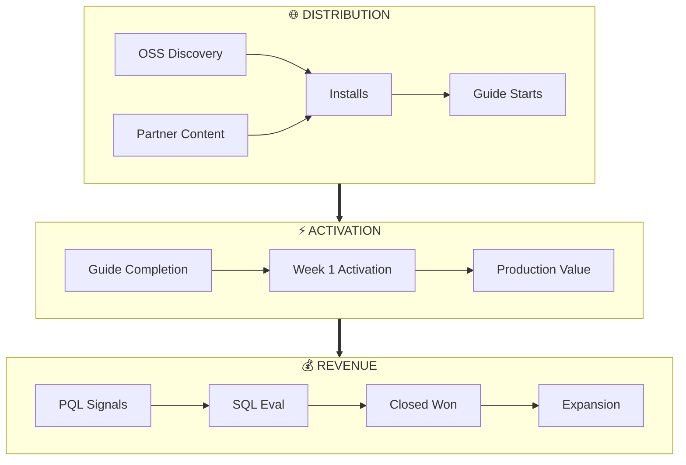
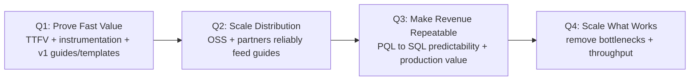

# FY26 Roadmap — Strategy Memo

**Bottom line:** FY26 is about making Boreal *undeniable in the first session*, then scaling that proof through OSS/partners and converting it through product-qualified sales. We will win by shipping **Guides + Templates** as our core product surface, measuring everything through **discoverability → activation → conversion**, and using **evidence-led outbound** to drive attention to that proof (not to sell promises).

---

## 1) The Strategy Kernel

### Diagnosis: what's happening and why

- **Developer infrastructure is crowded.** Buyers are skeptical and overwhelmed.
- **Trust is earned bottom-up.** Developers adopt what works quickly; then teams standardize.
- **Our biggest risk is friction.** If time-to-first-value is slow or unclear, distribution and sales won't matter.
- **Our second risk is unscalable work.** Bespoke enterprise requests can look like progress but don't compound.

### Guiding policy: how we will win

We will make Boreal easy to try, easy to prove, and easy to repeat.

- **Guides + Templates are the default delivery mechanism.**
  - Guides create a measured path from "new" → "working outcome" → "production outcome."
  - Templates make success repeatable and shareable.
- **We run the business on three reinforcing loops:**
  - Activation (PLM): reduce TTFV/TTPV, raise Week 1 activation
  - Distribution (OSS + Partners): drive qualified entrants into guides/templates
  - Revenue (Sales): convert product evidence into contracts via PQL signals
- **Outbound exists, but it serves evidence.**
  - Sales does not create demand through pressure.
  - Sales routes accounts into proof and follows up when signals indicate readiness.

### Coherent actions: what we will do (and when)

- Q1: Prove fast value (TTFV + instrumentation + v1 guides/templates)
- Q2: Scale distribution (OSS + partners reliably feed guides)
- Q3: Make revenue repeatable (predictable PQL→SQL + production value)
- Q4: Scale what works (remove bottlenecks + throughput)

---

## 2) FY26 Goals and Decision Rules

### Annual outcomes (3)

- **$10M ARR run-rate**
  - Acceptable slip: +2 quarters ("good"), +4 quarters ("passable")
- **Maintain 12+ months runway**
- **OSS traction: 20K GitHub stars**
  - Paired with usage signals (stars alone aren't enough)

### Tie-break rule (used in every planning meeting)

When initiatives compete, we prioritize changes that increase **discoverability → activation → conversion**, especially **TTFV/TTPV and Week 1 activation**, over bespoke work and top-down persuasion.

---

## 3) Operating Model: Three Loops

### The three loops we build everything around

- **Activation loop (PLM):** guides/templates reduce friction and create "first proof"
- **Distribution loop (OSS + Partners):** credible channels increase guide starts
- **Revenue loop (Sales):** sales converts activated usage into ARR and expansion

*The loops reinforce each other: expansion success (proof, templates, case studies) feeds back into distribution.*

---

## 4) Our Primary Product Surface: Guides + Templates

### Non-negotiable rule

New onboarding flows, partner content, and POC motions must land a user in a **guide and/or template**.
If work cannot be expressed as a guide/template, it is likely bespoke and hard to scale.

### Definitions (so we don't drift)

- **Guide:** instrumented journey from "new" → "working outcome" → "production outcome"
- **Template:** opinionated starting point (patterns/config/integrations) that makes success repeatable
- **Production value (TTPV):** running in the customer's environment with real systems/data, producing persistent outputs

---

## 5) Evidence-Led Outbound (Sales-Assisted PLM)

### What outbound is for

Outbound exists to **trigger product interaction with measurable outcomes**, not to sell promises.

### Guardrails (how we prevent "classic outbound rot")

- Every outbound touch routes to an **instrumented guide/template**
- Measured end-to-end: **source → guide start → completion → activation → PQL**
- Evaluated primarily on **activation outcomes**, not outbound volume or meetings booked

---

## 6) Metrics: what we will actually steer by

### Company steering metrics (6)

**Product**

1. **TTFV**
2. **Week 1 activation rate**
3. **# active Boreal projects** (usage depth)

**Revenue**

4. **PQL volume + PQL→SQL conversion**
5. **ARR** (add NRR once we have a meaningful base)

**OSS / Distribution**

6. **GitHub stars** (plus one usage proxy like OSS installs/month as supporting)

Everything else (booked meetings, total pipeline, community members, plan mix) is supporting—owned by functions, not "company KPIs."

---

## 7) FY26 Quarterly Plan

### Quarter themes

### Q1 — Prove Fast Value

**Outcomes**

- TTFV reliably **< 10 minutes**
- Activation + PQL instrumentation live and trusted
- Guides + Templates v1 is the default path

**Initiatives**

- **Guides + Templates v1:** flagship "first value" guide + starter templates
- **Golden path onboarding:** remove friction, increase completion
- **Instrumentation:** activation events + PQL scoring live (CRM + product)
- **Evidence-led outbound v1:** sales distributes guides, measured on activation

### Q2 — Scale Distribution

**Outcomes**

- Guide starts scale (more qualified developers enter activation loop)
- OSS/partner channels are measurable and repeatable
- First consistent PQL→SQL motion

**Initiatives**

- **Guides + Templates library v2:** expand to a menu of high-intent outcomes
- **Partner content engine:** standard landing pages + tracking + cadence
- **OSS docs/install loop:** improve discovery → install → guide start
- **Sales playbook v1:** follow-up sequences aligned to guide outcomes

### Q3 — Make Revenue Repeatable

**Outcomes**

- PQL→SQL conversion becomes predictable; cycles compress
- Clear path from activation → production value (TTPV drops materially)
- Expansion motion becomes provable (not hypothetical)

**Initiatives**

- **Production guides:** production-grade outcomes; fewer stalled POCs
- **Packaging/pricing tuning:** reduce confusion; align with usage/projects
- **Sales process hardening:** stage exit criteria; no "vibes pipeline"
- **Buyer partners:** influence pipeline with measurable downstream action

### Q4 — Scale What Works

**Outcomes**

- Growth engine documented and repeatable
- Activation holds under higher volume
- ARR run-rate achieved or clearly within the slip window

**Initiatives**

- **Platform excellence:** performance + reliability stop being constraints
- **Activation optimization:** improve conversion and retention
- **Partner flywheel:** dev + buyer partners operating at cadence
- **Sales capacity scaling:** only after playbook is proven

---

## 8) What we will not do (to protect focus)

- We will not pursue **outbound-led growth** as the primary motion.
- We will not build **bespoke enterprise features** without PLM validation.
- We will not run awareness campaigns without an **activation path** (every campaign routes into a guide/template).
- We will not chase revenue that undermines **retention, expansion, or repeatability**.

---

## 9) How we execute: quarterly planning output

### Required output each quarter

1. Goals (3–5 max)
2. Initiatives (3–5 max)
3. Starter project list (1–3 weeks each)
4. One-page narrative (this memo style)
5. "Killed work" list (explicit)

### Initiative template (copy/paste)

- **Owner:**
- **Goal (metric):**
- **What ships (deliverables):**
- **How we measure success (leading + lagging):**
- **Dependencies / risks:**
- **Weekly check-in:** Goal / Progress / Blockers / Next step
- **Kill criteria (when we stop):**

---

## Next steps (so this turns into action)

- Pick **Q1 goals (3–5)** and lock them.
- Choose **Q1 initiatives (max 4)** and name owners.
- Define the **flagship "first value" guide** and the **2–3 templates** that support it.
- Instrument: confirm the exact events for **guide start, completion, Week 1 activation, and PQL**.
- Publish the **evidence-led outbound rules** and update sales scorecards to reflect them.
