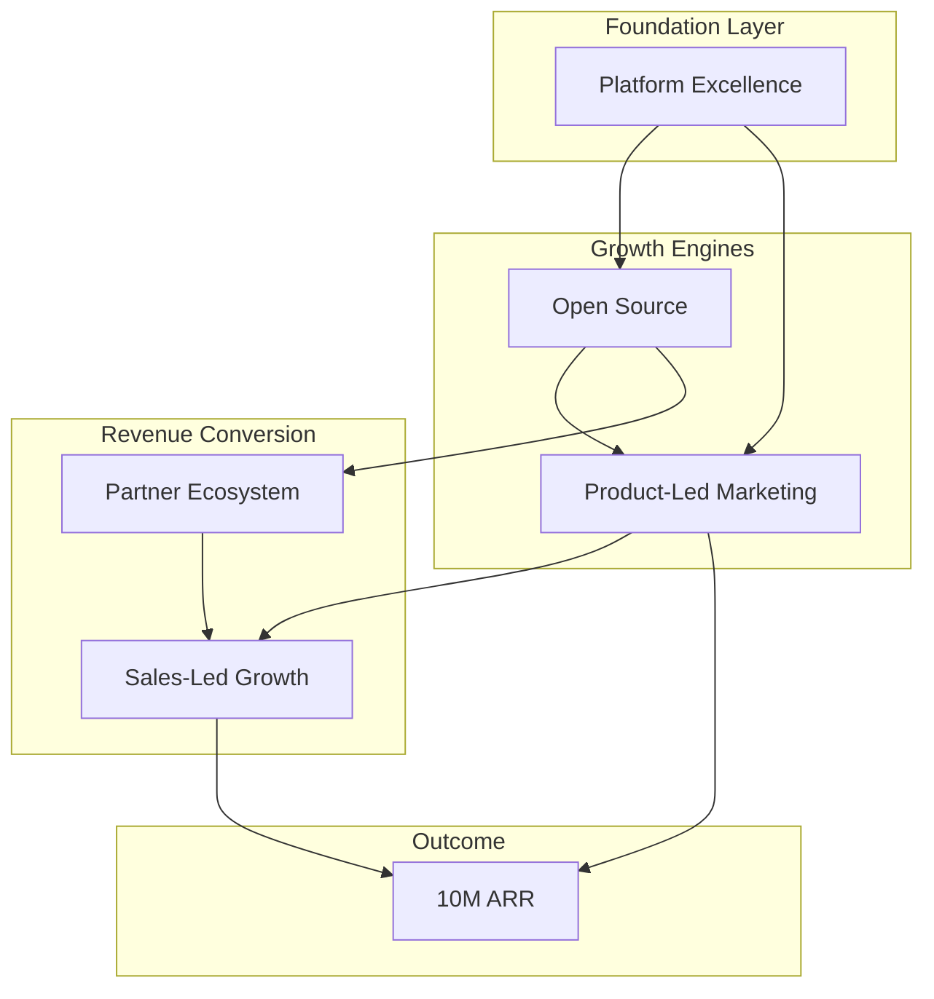
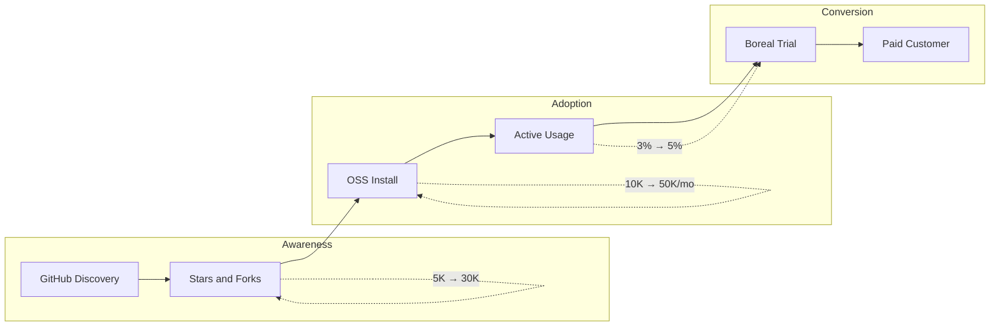
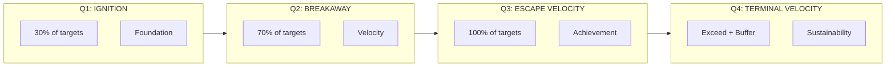
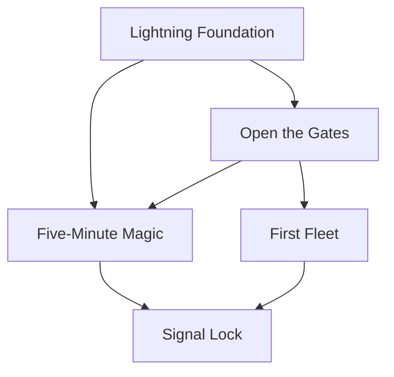
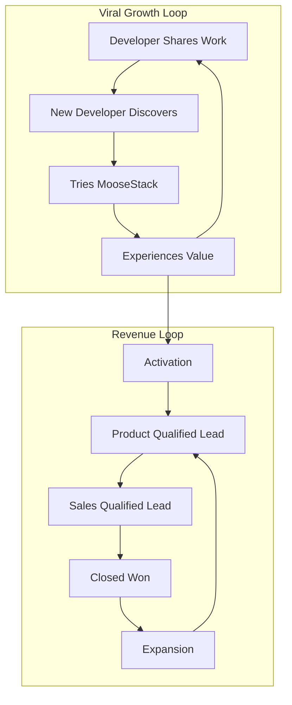
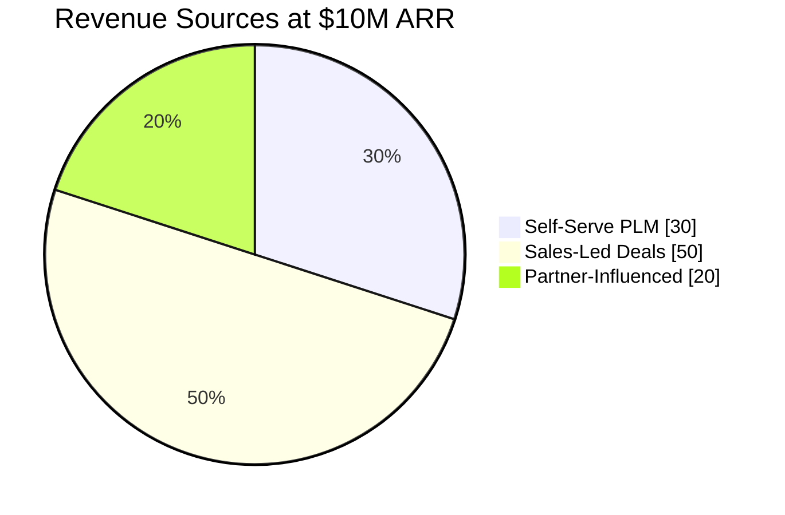
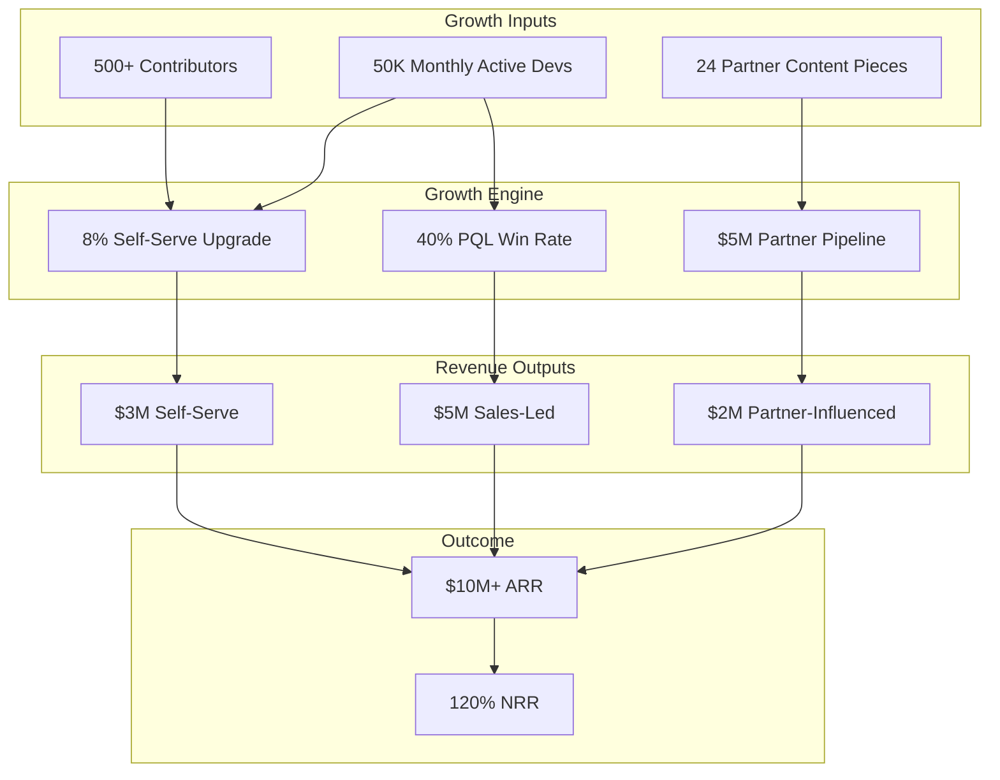
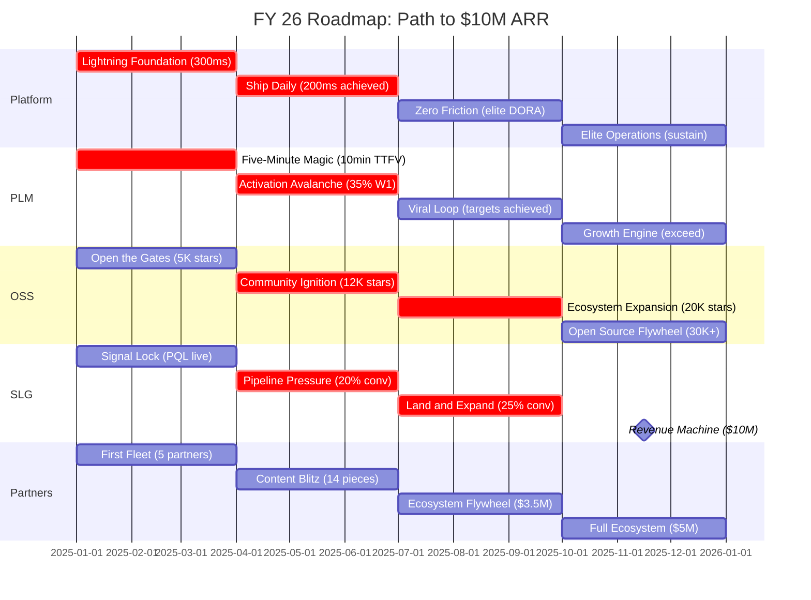

# FY 26 Roadmap

The path to $10M ARR in 12 months. This roadmap breaks down our five strategic goals into aggressive quarterly initiatives with clear ownership and measurable targets.

## Strategic Pillars

The five pillars work together to create a reinforcing growth engine:

---

## Open Source Strategy

MooseStack is the open-source foundation that drives Boreal adoption:

**Key OSS Metrics:**
- GitHub stars (awareness)
- Monthly installs (adoption)
- Active contributors (community health)
- OSS-to-Boreal conversion rate (monetization)

---

## Quarterly Progression

Each quarter builds on the last, with aggressive front-loading of targets:

---

## Q1: IGNITION (Months 1-3)

*"Move fast, break nothing, ship everything."*

| Pillar | Initiative | Target | Owner |
|--------|------------|--------|-------|
| **Platform** | **Lightning Foundation** | P95 latency to 300ms (40% reduction); 75% onboarding completion; 12 deploys/week | CTO |
| **PLM** | **Five-Minute Magic** | Time-to-first-value under 10 minutes; 25% Week 1 activation; Full activation instrumentation live | Head of Product |
| **PLM/OSS** | **Open the Gates** | 5,000 GitHub stars; 50 external contributors; MooseStack docs revamp live; First 10K OSS installs/month | CTO |
| **SLG** | **Signal Lock** | PQL scoring live in HubSpot; First 10 PQL-to-SQL conversions; Sales team trained on product-led motion | Head of Sales |
| **Partners** | **First Fleet** | 5 anchor partners signed; 6 co-created content pieces shipped; First partner webinar with 500+ registrants | Chief of Staff |

### Q1 Success Criteria

- Platform foundation supports 10x growth without rearchitecture
- Developers can experience value in their first session
- OSS community shows early signs of self-sustaining growth
- Sales has the tools and training to work product-qualified leads
- First partner relationships established with clear co-marketing plans

### Q1 Initiative Dependencies

---

## Q2: BREAKAWAY (Months 4-6)

*"Outpace the market. Every week counts."*

| Pillar | Initiative | Target | Owner |
|--------|------------|--------|-------|
| **Platform** | **Ship Daily** | P95 latency to 200ms (target achieved); 18 deploys/week; Change failure rate under 8%; MTTR under 60 minutes | CTO |
| **PLM** | **Activation Avalanche** | TTFV under 7 minutes; 35% Week 1 activation; 4% self-serve upgrade rate; 15% viral signups | Head of Product |
| **PLM/OSS** | **Community Ignition** | 12,000 GitHub stars; 150 contributors; First community-led feature shipped; 25K OSS installs/month; Discord at 2,000 members | CTO |
| **SLG** | **Pipeline Pressure** | 20% PQL-to-SQL conversion; Sales cycle under 60 days; First $75K+ deal closed; 15 enterprise POCs active | Head of Sales |
| **Partners** | **Content Blitz** | 14 cumulative content pieces; 12% content-to-signup rate; 20 partner-sourced opportunities; $1.5M pipeline | Chief of Staff |

### Q2 Success Criteria

- Platform performance targets achieved — no longer a constraint
- Activation funnel optimized with clear conversion paths
- OSS community actively contributing, not just consuming
- First major enterprise deal closed, proving SLG motion works
- Partner content engine running at cadence

---

## Q3: ESCAPE VELOCITY (Months 7-9)

*"Growth that compounds. Revenue that scales."*

| Pillar | Initiative | Target | Owner |
|--------|------------|--------|-------|
| **Platform** | **Zero Friction** | 82% onboarding completion; 20 deploys/week; 5% change failure rate; 35-minute MTTR | CTO |
| **PLM** | **Viral Loop** | TTFV under 5 minutes (target achieved); 40% Week 1 activation (target achieved); 6% self-serve; 20% viral; 45% retention | Head of Product |
| **PLM/OSS** | **Ecosystem Expansion** | 20,000 GitHub stars; 300 contributors; 3 major community plugins; 40K OSS installs/month; OSS-to-Boreal conversion at 3% | CTO |
| **SLG** | **Land and Expand** | 25% PQL-to-SQL (target achieved); 50-day sales cycle; $65K ACV; 20% expansion revenue; 35% PQL win rate | Head of Sales |
| **Partners** | **Ecosystem Flywheel** | 20 content pieces; 15% content-to-signup (target achieved); 40 partner opportunities; $3.5M pipeline | Chief of Staff |

### Q3 Success Criteria

- Most annual targets achieved — Q4 is for exceeding, not catching up
- Product-led growth is self-sustaining with viral mechanics working
- OSS ecosystem has independent momentum with community plugins
- Sales motion is repeatable and predictable
- Partners are actively driving pipeline

### Q3 Growth Flywheel

---

## Q4: TERMINAL VELOCITY (Months 10-12)

*"Cross the finish line at full speed."*

| Pillar | Initiative | Target | Owner |
|--------|------------|--------|-------|
| **Platform** | **Elite Operations** | 85% onboarding (target achieved); 20+ deploys/week; 5% CFR; 30-minute MTTR (all targets achieved) | CTO |
| **PLM** | **Growth Engine** | All targets achieved + buffer: 8%+ self-serve upgrade; 25%+ viral signups; 50%+ retention | Head of Product |
| **PLM/OSS** | **Open Source Flywheel** | 30,000+ GitHub stars; 500+ contributors; MooseStack as category leader; 50K+ OSS installs/month; 5% OSS-to-Boreal conversion | CTO |
| **SLG** | **Revenue Machine** | All targets achieved: 40% PQL win rate; 45-day cycle; $75K ACV; 30% expansion; NRR at 120% | Head of Sales |
| **Partners** | **Full Ecosystem** | All targets achieved: 24 pieces; 50 opportunities; $5M pipeline; Partners actively selling Boreal | Chief of Staff |

### Q4 Success Criteria

- $10M ARR run rate achieved or exceeded
- All strategic goals met with buffer for FY27
- Growth engine is repeatable and documented
- Team and systems ready to scale beyond $10M

### Q4 Revenue Composition

### End State Architecture

---

## Visual Timeline

---

## Linked Goals

This roadmap drives progress toward these strategic objectives:

- [Reach $10M ARR](/goals/10m-arr) — The anchor company goal
- [Win Developers Through PLM](/goals/plm-developers) — Product-led growth for developers
- [Convert Usage Into Revenue](/goals/slg-buyers) — Sales-led growth for buyers
- [Build Awareness Through Partners](/goals/partner-awareness) — Partner-driven distribution
- [Build a Platform That Scales](/goals/platform-execution) — Infrastructure and execution excellence

